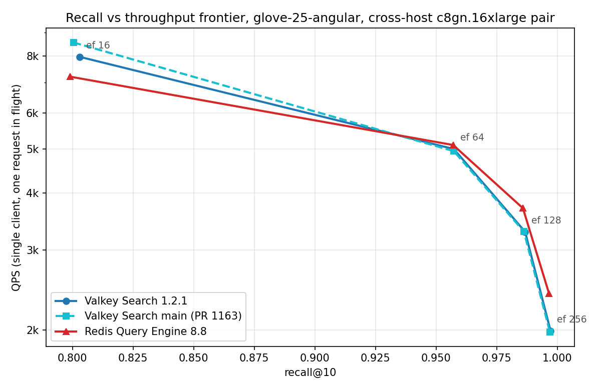
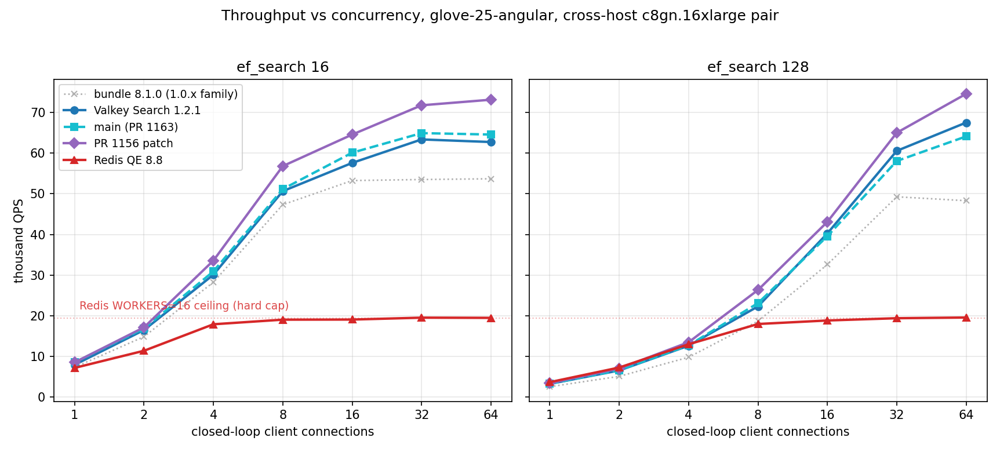

# Valkey Search HNSW Performance: Releases, Patches, and vs Redis

Measured with `valkey-lab search` ([cachecannon PR #116](https://github.com/cachecannon/cachecannon/pull/116)), an open benchmarking harness that reports vector-search performance the way ann-benchmarks does: as points in (recall, latency, throughput) space against precomputed ground truth, never as a lone throughput number.

Author: ksmotiv8. First published 2026-07-22; unified cross-host campaign (all seven engines on one instance pair) 2026-07-23. Earlier single-host results are preserved in the appendix.

## Executive summary

Seven engine configurations, one methodology: every number in the main body comes from the same client instance driving the same server instance across a real network hop, same dataset (ann-benchmarks glove-25-angular: 1,183,514 vectors, 25 dimensions, cosine), same day. The engines span three released valkey-bundle versions, the current bundle, a Valkey Search module built from main (upstream PR 1163), an alternative patch build (PR 1156), and Redis 8.8 with its built-in Query Engine.

Headline results:

1. **Recall parity everywhere.** All seven engines agree on recall@10 to within a few parts in ten thousand at every operating point. No throughput or latency difference below is explained by a recall tradeoff.
2. **Valkey Search 1.2.1 is a real performance release.** Against the 1.0.x module family it delivers 27 to 34 percent more single-client throughput, about 25 percent more saturated throughput, and index builds nearly twice as fast (21.5 s versus 38.6 to 44.9 s). The earlier finding that "releases perform identically" holds only within the 1.0.x family and is superseded for 1.2.1.
3. **Two experimental module builds improve further.** The main-branch build with [PR 1163](https://github.com/valkey-io/valkey-search/pull/1163) (SimSIMD on by default plus a three-phase prefetch pipeline) matches 1.2.1 medians but cuts the p99.9 tail by about 30 percent. The [PR 1156](https://github.com/valkey-io/valkey-search/pull/1156) patch build (native SIMD dispatch, SVE on Graviton, plus configurable prefetch lookahead) goes further: 4 to 5 percent better single-client throughput at mid and high ef, the same improved tails, and the highest saturated throughput measured in this report, 74,554 QPS.
4. **Against Redis, single-client latency splits by operating point and Redis owns the extreme tail.** Redis's p99.9 stays at 0.3 to 0.7 ms while every Valkey build shows a load-independent 2 to 3.6 ms p99.9 spike on roughly one query in a thousand. Single-client throughput favors Valkey at low ef and Redis at high ef.
5. **Under concurrency the picture inverts.** The Redis Query Engine is hard-capped at 16 worker threads in this build (`FT.CONFIG SET WORKERS` rejects larger values) and plateaus at about 19.5k QPS. Valkey builds scale to 48k (1.0.x), 63 to 67k (1.2.1 and main), and 73 to 75k (PR 1156). Lowering Valkey to the same 16 threads barely moves its ceiling, so the gap is architectural, not a thread-count artifact.
6. **Operational configuration still dominates.** Default RDB persistence can wedge a server under index churn, long-running server processes drift measurably, and a client-side measurement artifact had to be found and excluded. Details in the findings and measurement notes.

## Methodology

- **Nodes.** Two identical c8gn.16xlarge instances (Graviton, 64 vCPU, 123 GB), same cluster placement group, us-west-2c, Amazon Linux 2023, kernel 6.18.36, Docker 25.0.14. One runs the harness, the other runs the engine containers on host networking, one engine exercised at a time. Both instances are dedicated to this work.
- **Harness**: `valkey-lab search` (Rust, io_uring based, single binary), built against ringline 0.5.3. One event-loop core drives all query connections. Three phases measured independently:
  - *Load*: pipelined `HSET doc:<row> vec <float32 little-endian>` of every train vector, 256 KiB byte-budgeted batches on one connection.
  - *Index*: `FT.CREATE ... VECTOR HNSW ... M 16 EF_CONSTRUCTION 200`, then polling `FT.INFO` until fully ready. Build time is FT.CREATE to ready.
  - *Query*: `FT.SEARCH` KNN with `EF_RUNTIME`, `NOCONTENT`, `LIMIT 0 10`, `DIALECT 2`; recall@10 scored with set semantics against precomputed ground truth.
- **Single-client frontier**: every (engine, ef_search) point is an independent full cycle: fresh load, fresh index build, then 10,000 queries on one connection with one request in flight. Build and ingest are therefore measured four times per engine.
- **Throughput ladders**: N connections, each closed loop with one request in flight, query indices dealt from a shared counter, per-request latencies pooled. The single client core was verified not to be the bottleneck at these rates.
- **Persistence disabled** (`save ""`, `appendonly no`) everywhere; engine query-thread settings left at their shipped defaults except where the equalization section says otherwise.
- k=10, M=16, EF_CONSTRUCTION=200 throughout; ef_search swept over {16, 64, 128, 256}.

## Engines measured

| Column | Container image | Server | Vector search | Ingest (vec/s) | Build (s) |
|---|---|---|---|---|---|
| 8.1.0 | valkey/valkey-bundle:8.1.0 | valkey 8.1.2 | module 1.0.0 | 492k to 549k | 44.2 to 44.9 |
| 8.1.8 | valkey/valkey-bundle:8.1.8 | valkey 8.1.8 | module 1.0.3 | 531k to 587k | 38.6 to 38.8 |
| 9.0.3 | valkey/valkey-bundle:9.0.3 | valkey 9.0.4 | module 1.0.0 | 525k to 574k | 42.1 to 42.3 |
| 1.2.1 | valkey/valkey-bundle:9 | valkey 9.1.0 | module 1.2.1 (encoded 66049) | 470k to 565k | 21.4 to 21.5 |
| Main | valkey/valkey:9 + module | valkey 9.1.1 | main @ `578a75a` (includes PR 1163) | 519k to 599k | 21.6 to 22.0 |
| 1156 | valkey/valkey:9 + module | valkey 9.1.1 | PR 1156 patch @ `8b14f41` (base `59c44b4`) | 549k to 576k | 20.8 to 21.6 |
| Redis | redis:8 | redis 8.8.0 | Redis Query Engine (built in) | 572k to 678k | 38.6 to 39.3 |

Notes: the `valkey-bundle:9.0.3` tag ships server 9.0.4. Query threading as shipped: Valkey Search reader-threads 64 and writer-threads 64 (auto-set to core count), Redis Query Engine WORKERS 16 (the maximum this build accepts). The two module source builds compile in a Debian bookworm container with gcc 12.2; PR 1156 sits on an older main base (`59c44b4`, about 100 commits behind `578a75a`), so its comparison against Main is approximately but not perfectly isolated to the patch itself (the visible intervening commits are bug fixes rather than query-path work).

## Single-client frontier, one dimension at a time

Each table compares all seven engines on one dimension; every cell is from an independent full cycle. Latency in milliseconds.

Recall@10:

| ef_search | 8.1.0 | 8.1.8 | 9.0.3 | 1.2.1 | Main | 1156 | Redis |
|---|---|---|---|---|---|---|---|
| 16 | 0.7991 | 0.7986 | 0.7993 | 0.8030 | 0.8004 | 0.7996 | 0.7990 |
| 64 | 0.9558 | 0.9569 | 0.9575 | 0.9573 | 0.9573 | 0.9569 | 0.9570 |
| 128 | 0.9857 | 0.9861 | 0.9865 | 0.9867 | 0.9862 | 0.9863 | 0.9858 |
| 256 | 0.9969 | 0.9970 | 0.9971 | 0.9972 | 0.9969 | 0.9971 | 0.9966 |

QPS:

| ef_search | 8.1.0 | 8.1.8 | 9.0.3 | 1.2.1 | Main | 1156 | Redis |
|---|---|---|---|---|---|---|---|
| 16 | 7,353 | 7,181 | 7,155 | 7,965 | 8,567 | 8,570 | 7,206 |
| 64 | 4,059 | 3,833 | 3,894 | 4,996 | 4,942 | 5,124 | 5,099 |
| 128 | 2,582 | 2,446 | 2,470 | 3,287 | 3,290 | 3,457 | 3,703 |
| 256 | 1,506 | 1,448 | 1,442 | 1,990 | 1,981 | 2,083 | 2,402 |

p50 latency:

| ef_search | 8.1.0 | 8.1.8 | 9.0.3 | 1.2.1 | Main | 1156 | Redis |
|---|---|---|---|---|---|---|---|
| 16 | 0.130 | 0.132 | 0.133 | 0.110 | 0.112 | 0.110 | 0.137 |
| 64 | 0.242 | 0.257 | 0.253 | 0.194 | 0.198 | 0.188 | 0.195 |
| 128 | 0.386 | 0.403 | 0.400 | 0.299 | 0.302 | 0.286 | 0.271 |
| 256 | 0.662 | 0.684 | 0.687 | 0.495 | 0.502 | 0.477 | 0.418 |

p99 latency:

| ef_search | 8.1.0 | 8.1.8 | 9.0.3 | 1.2.1 | Main | 1156 | Redis |
|---|---|---|---|---|---|---|---|
| 16 | 0.244 | 0.182 | 0.183 | 0.261 | 0.143 | 0.164 | 0.156 |
| 64 | 0.301 | 0.312 | 0.312 | 0.252 | 0.260 | 0.261 | 0.223 |
| 128 | 0.471 | 0.488 | 0.480 | 0.372 | 0.370 | 0.344 | 0.309 |
| 256 | 0.819 | 0.839 | 0.848 | 0.621 | 0.619 | 0.576 | 0.485 |

p99.9 latency:

| ef_search | 8.1.0 | 8.1.8 | 9.0.3 | 1.2.1 | Main | 1156 | Redis |
|---|---|---|---|---|---|---|---|
| 16 | 2.035 | 2.941 | 2.896 | 2.882 | 2.001 | 1.965 | 0.317 |
| 64 | 2.221 | 3.037 | 3.064 | 3.027 | 2.119 | 2.075 | 0.419 |
| 128 | 2.410 | 3.281 | 3.246 | 3.150 | 2.214 | 2.214 | 0.487 |
| 256 | 2.723 | 3.584 | 3.562 | 3.374 | 2.489 | 2.437 | 0.693 |



What the frontier shows:

- **The 1.0.x family clusters tightly** (within about 5 percent of each other), repeating the appendix finding that those releases are interchangeable on this workload.
- **1.2.1 lifts the whole Valkey curve**: +27 to 34 percent QPS over the 1.0.x cluster at every point, from lower medians rather than changed recall.
- **Redis wins the high-ef end at one client** (ef 128 and 256, by 7 to 15 percent over the best Valkey build) and loses the low-ef end; the curves cross near recall 0.93.
- **The tail hierarchy is three-tiered and load-independent**: Redis at 0.3 to 0.7 ms, the PR builds at 2.0 to 2.5 ms, released Valkey modules at 2.9 to 3.6 ms (with 8.1.0 an odd partial exception at 2.0 to 2.7 ms). These are one-request-in-flight numbers with no queueing, and the Valkey spike affects about one query in a thousand at every rate measured, so comparing at identical TPS would not close the gap.
- Run-to-run spread on repeated c1 points was about 8 percent at ef 16 and 2 to 3 percent elsewhere; treat single-digit differences accordingly.

### The PR 1163 build: tails, not medians

The main-branch module (SimSIMD enabled by default plus a fixed three-phase prefetch pipeline) is within 2 to 3 percent of released 1.2.1 on every median, but its p99.9 drops from 2.9 to 3.4 ms to 2.0 to 2.5 ms, roughly 30 percent, consistent across three separate rounds of runs. The PR's own benchmarks measured 11 to 16 percent median improvements on 1024-dimensional vectors on an AMD host; at 25 dimensions the distance arithmetic is a small share of query time, so median parity here does not contradict that result.

### The PR 1156 build: the fastest configuration measured

The [PR 1156](https://github.com/valkey-io/valkey-search/pull/1156) patch takes a different route to the same two ideas: it compiles with native SIMD dispatch (`-mcpu=native`, which on Graviton enables SVE rather than generic NEON) and replaces the fixed prefetch with a configurable lookahead (`search.prefetch-lookahead`, default 4, left at default here). Against the Main build:

- Single client: ties at ef 16 (8,570 vs 8,567), then +3.7 percent at ef 64, +5.1 percent at ef 128, +5.2 percent at ef 256, with better p99 at the high end (0.344 vs 0.370 at ef 128, 0.576 vs 0.619 at ef 256).
- Tails: equal to the Main build (1.97 to 2.44 ms p99.9), that is, both PR builds carry the roughly 30 percent tail improvement over 1.2.1.
- Saturation: +13 to 16 percent (73,119 vs 64,556 QPS at ef 16 with 64 connections; 74,554 vs 64,096 at ef 128), with the best under-load p99 of any engine (1.12 and 1.23 ms at 64 connections). 74,554 QPS is the highest throughput measured in this report.
- Build time 20.8 to 21.6 s, nominally the fastest.

Caveat: the patch sits on an older main base (about 100 commits behind the Main build's), so a small part of the delta could come from base drift, though the intervening commits appear to be bug fixes rather than performance work. At ef 256 single-client it closes most of Redis's high-ef lead (2,083 vs 2,402) without giving up the concurrency ceiling.

#### Sweeping the lookahead: the default leaves 17 to 21 percent on the table

The lookahead is a runtime config (`search.prefetch-lookahead`, accepted range 0 to 64, read before each search), so we swept it live against the loaded index. QPS by lookahead value (index-reuse mode, internally consistent):

| Lookahead | ef 128 c1 | ef 256 c1 | ef 128 c8 | ef 128 c64 | ef 16 c64 |
|---|---|---|---|---|---|
| 0 (off) | 2,716 | 1,627 | 20,778 | 71,284 | 76,657 |
| 1 | 2,978 | 1,779 | 22,093 | 72,115 | 77,005 |
| 2 | 3,231 | 1,938 | 22,858 | 67,670 | 71,757 |
| 4 (default) | 3,482 | 2,096 | 25,086 | 68,624 | 71,560 |
| 8 | 3,673 | 2,258 | 26,765 | 68,327 | 72,759 |
| 16 | 3,771 | 2,408 | 27,809 | 72,813 | 77,231 |
| 32 | 4,081 | 2,533 | 28,965 | 71,791 | 75,910 |
| 64 | 3,734 | 2,480 | 29,334 | 70,702 | 76,864 |

Three things fall out:

- **Prefetch is a low-concurrency lever.** At one client it is worth +50 to 56 percent over prefetch-off; at 64 connections it is worth almost nothing (the thread pool already hides memory latency by parallelism). The response surface peaks around lookahead 32 for single-client work and 16 for saturation, with mild decline past the peak.
- **The default of 4 leaves 17 to 21 percent of single-client throughput on the table.** This is the configurability argument in one row: no fixed pipeline depth is right for both regimes, and the right value is not the shipped one.
- **Tuned, this build beats Redis single-client at every operating point.** Confirmed with independent full cycles at lookahead 32: ef 128 at 4,076 QPS (Redis 3,703, +10 percent) with better p50 (0.242 vs 0.271) and better p99 (0.289 vs 0.309), and ef 256 at 2,491 (Redis 2,402, +3.7 percent) with better p50, at identical recall. Redis's remaining single-client advantage reduces to the p99.9 tail alone. The lookahead-16 saturation rungs also set new report peaks (77,231 QPS at ef 16, 64 connections).

Sweep numbers are one run per cell in index-reuse mode (valid for comparing lookahead values against each other; the two Redis-beating claims above were re-verified with full cycles). Lookahead was reset to the default afterward.

## Throughput ladders: closed-loop concurrency

QPS by connection count (c1 from the full-cycle frontier runs; ladder rungs reuse the loaded index). Redis column from a freshly restarted process.

ef_search 16, QPS:

| Clients | 8.1.0 | 8.1.8 | 9.0.3 | 1.2.1 | Main | 1156 | Redis |
|---|---|---|---|---|---|---|---|
| 1 | 7,353 | 7,181 | 7,155 | 7,965 | 8,567 | 8,570 | 7,206 |
| 2 | 14,884 | 14,199 | 13,917 | 16,510 | 16,890 | 17,168 | 11,417 |
| 4 | 28,274 | 25,865 | 26,198 | 30,103 | 30,920 | 33,583 | 17,927 |
| 8 | 47,317 | 43,138 | 43,335 | 50,644 | 51,152 | 56,800 | 19,058 |
| 16 | 53,246 | 48,587 | 48,885 | 57,581 | 60,094 | 64,547 | 19,084 |
| 32 | 53,498 | 50,329 | 51,818 | 63,353 | 64,906 | 71,743 | 19,548 |
| 64 | 53,684 | 50,842 | 52,584 | 62,718 | 64,556 | 73,119 | 19,500 |

ef_search 128, QPS:

| Clients | 8.1.0 | 8.1.8 | 9.0.3 | 1.2.1 | Main | 1156 | Redis |
|---|---|---|---|---|---|---|---|
| 1 | 2,582 | 2,446 | 2,470 | 3,287 | 3,290 | 3,457 | 3,703 |
| 2 | 5,124 | 4,971 | 4,998 | 6,572 | 6,666 | 7,065 | 7,295 |
| 4 | 9,822 | 9,680 | 9,775 | 12,658 | 12,743 | 13,510 | 13,016 |
| 8 | 18,699 | 18,501 | 18,537 | 22,315 | 23,120 | 26,351 | 17,993 |
| 16 | 32,607 | 31,921 | 32,175 | 40,254 | 39,574 | 43,098 | 18,858 |
| 32 | 49,256 | 46,127 | 48,822 | 60,544 | 58,055 | 64,996 | 19,415 |
| 64 | 48,294 | 48,504 | 51,322 | 67,495 | 64,096 | 74,554 | 19,581 |

p99 at 64 connections (ms), for the saturation picture: 8.1.0 3.07 and 3.13 (ef 16 and 128), 8.1.8 4.04 and 3.94, 9.0.3 3.95 and 3.82, 1.2.1 1.20 and 1.73, Main 1.17 and 1.87, 1156 1.12 and 1.23, Redis 3.70 and 4.95.



What the ladders show:

- **Redis hits a hard ceiling at about 19.5k QPS** from 8 connections onward, at both operating points, matching its Query Engine's WORKERS value of 16, the maximum this build accepts (see the equalization section). Past the ceiling, added concurrency converts entirely into queueing: p99 climbs to 5 ms while QPS stays flat.
- **Every Valkey build clears the Redis ceiling by 2.5x or more**: the 1.0.x family saturates at 48 to 54k, 1.2.1 and Main at 63 to 67k, and the 1156 build at 73 to 75k.
- **The crossover flips the single-client story.** Redis's high-ef single-client advantage disappears by 8 connections; from there the Valkey advantage grows monotonically.
- **Module generations separate cleanly under load**: 1.0.x to 1.2.1 is about +25 percent at saturation, and 1156 adds another +13 to 16 percent over Main.

**Read latencies at equal load, not equal connection count.** These are closed-loop ladders, so a row compares equal concurrency, not equal throughput: at 64 connections the 1156 build is serving about 74k QPS while Redis is serving about 19.5k, and Redis's multi-millisecond latencies there are saturation queueing, not the latency an operator would see at a sane operating point. Matching rungs by achieved QPS instead (ef 128): at about 7k QPS, Redis p99 0.322 ms versus 1.2.1's 0.385; at about 13k, 0.484 versus 0.466; at 18k to 22k, 0.649 versus 0.598. Below the Redis ceiling, iso-load latencies are close, with Redis slightly ahead at light load. The engines separate not on latency at a given load but on the range of loads they can serve at all. (The single-client frontier tables are load-matched by construction, one request in flight on both engines, so their latency comparisons carry no such caveat.)

### Thread equalization: the ceiling gap is architectural, not a thread-count artifact

The obvious objection to the ladder is that 64 search threads against 16 workers is not a fair fight. Two follow-up measurements address it:

- **The Redis side cannot be raised.** `FT.CONFIG SET WORKERS 64` (and any value above 16) is rejected with `SEARCH_LIMIT_OVER: Number of worker threads cannot exceed 16` on this redis:8 build. The 19.5k ceiling is not a conservative default; it is the maximum this build allows.
- **Lowering Valkey to the same 16 threads barely moves its ceiling.** `search.reader-threads` is runtime-tunable; we set it to 16 (verified as exactly 16 live `read-worker` threads in the server process) and re-ran the ladder on the 1.2.1 engine:

| Clients | ef 16 QPS | p99 | ef 128 QPS | p99 |
|---|---|---|---|---|
| 4 | 31,319 | 0.179 | 12,335 | 0.472 |
| 8 | 53,797 | 0.230 | 22,516 | 0.574 |
| 16 | 65,210 | 0.409 | 39,906 | 0.632 |
| 32 | 71,876 | 0.686 | 59,436 | 0.760 |
| 64 | 74,085 | 1.048 | 60,185 | 3.356 |

At equal thread counts, Valkey's ceiling is 60k to 74k QPS against Redis's 19.5k: still 3.1x to 3.8x. The per-thread arithmetic is stark: roughly 4,600 QPS per reader thread at ef 16 versus roughly 1,200 QPS per worker. Two second-order observations: at ef 16, sixteen threads actually outperforms the 64-thread default (74.1k versus 64.9k peak, with lower p99), suggesting the default oversubscribes for cheap queries; at ef 128 with 64 connections the smaller pool starts to queue (p99 rises to 3.4 ms and peak drops about 11 percent), so the default earns its keep on expensive queries. Reader threads were restored to 64 afterward.

## Ingest, build, and memory

- Ingest (pipelined HSET from one client connection, 256 KiB batches): every engine lands between 470k and 678k vectors/s, with Redis fastest (572k to 678k) and the ordering otherwise within run-to-run spread. The deeper client pipeline enabled by ringline 0.5.3 raised all numbers relative to the appendix campaign (which used 8 KiB batches).
- Index build separates by module generation: 1.2.1, Main, and 1156 build the 1.18M-vector index in 20.8 to 22.0 s; the 1.0.x family takes 38.6 to 44.9 s; Redis takes 38.6 to 39.3 s. The current Valkey modules build about 1.8x faster than Redis; the 1.0.x modules build at Redis speed.
- Memory after load plus index: Redis 1.02 GiB, 1156 build 1.28 GiB, 1.2.1 and Main 1.30 to 1.31 GiB, 1.0.x family 1.38 GiB. Redis holds the same dataset and index in about 20 to 26 percent less memory than the Valkey builds.

## Measurement notes

- **A harness artifact was found and excluded.** The harness's index-reuse mode (added so ladders would not reload 1.18M vectors per rung) shows a false latency floor of about 0.26 ms against Redis only, single connection only, when the request rate would otherwise exceed roughly 4k QPS; the cause is client-side and still under investigation. All single-client numbers in this report therefore come from full-cycle runs, where the effect does not occur; ladder rungs at 2 or more connections were verified unaffected.
- **Long-running server processes drift.** A Redis process that had served hours of benchmark churn lost about a quarter of its single-client throughput at mid ef (about 5,000 down to 3,830 QPS) and recovered fully on restart. The Redis numbers here are from a fresh process. This is the query-path sibling of the persistence and server-state findings below.
- Engine defaults as shipped except the equalization experiment; closed-loop saturation on one client event-loop core; open-loop arrival patterns may place the knee differently.

## Operational findings

These findings originate in the earlier single-host campaign (appendix) and remain valid operational guidance:

### 1. Default RDB persistence can wedge the server under index churn

With default persistence, repeated cycles of loading 1.18M keys and creating and dropping the HNSW index caused background RDB saves (fork plus copy-on-write) to interact badly with the search module's fork callbacks; the server eventually stopped answering PING and had to be restarted. Even before wedging, fork pauses polluted tail latency (44.9 ms max query latency with persistence on versus under 2 ms without). Benchmark, and where the durability tradeoff is acceptable operate, vector-search workloads with `save ""` and `appendonly no`.

### 2. Server-state history distorts results

A server that had been through the persistence wedge and restart ingested at 61k vectors/s versus 319k to 438k fresh, and the penalty survived disabling persistence. The cross-host campaign added a query-path example: a long-running Redis process lost about a quarter of its mid-ef throughput until restarted. Benchmark on fresh server processes.

### 3. Client pitfalls the harness had to engineer around

- `SCAN`'s `COUNT` is a hint the server can overshoot severalfold (1,186 keys returned with `COUNT 256`); clients with bounded reply parsers must not assume `COUNT` bounds the reply. Bulk cleanup moved server-side into a short script.
- `FT.INFO` in Valkey Search reports `state`, `backfill_in_progress`, and `mutation_queue_size` rather than RediSearch's `percent_indexed`; index-build timing must poll the three-field ready condition.
- Vectors must be written as little-endian FLOAT32 bytes; a dtype or endianness mismatch does not error, it silently destroys recall.

## Reproduction

```bash
# Server node: engines as host-network containers, persistence off
docker run -d --name vs --network host valkey/valkey-bundle:9 \
    valkey-server --port 6379 --save "" --appendonly no --protected-mode no
docker run -d --name rs --network host redis:8 \
    redis-server --port 6380 --save "" --appendonly no --protected-mode no

# Module-from-source engines: build in a Debian bookworm container (gcc >= 12),
# then load into the plain valkey image
git clone --recurse-submodules https://github.com/valkey-io/valkey-search
docker run --rm -v "$PWD/valkey-search:/src" -w /src debian:bookworm bash -c \
  "apt-get update -qq && apt-get install -y -qq build-essential g++ cmake ninja-build \
   libssl-dev libgtest-dev libsystemd-dev git curl && ./build.sh"
docker run -d --name vsmain --network host \
    -v "$PWD/valkey-search/.build-release/libsearch.so:/opt/libsearch.so:ro" \
    valkey/valkey:9 valkey-server --port 6381 --save "" --appendonly no \
    --protected-mode no --loadmodule /opt/libsearch.so

# Client node (harness, cachecannon PR 116 branch)
git clone https://github.com/cachecannon/cachecannon && cd cachecannon
git checkout search-harness
cargo build --release --features search --bin valkey-lab   # needs cmake >= 3.26
curl -LO http://ann-benchmarks.com/glove-25-angular.hdf5

# Single-client frontier point (full cycle)
./target/release/valkey-lab search --dataset glove-25-angular.hdf5 \
    -H <server-ip> --port 6379 --ef-search 128

# Throughput ladder rung (after a --keep-index run)
./target/release/valkey-lab search --dataset glove-25-angular.hdf5 \
    -H <server-ip> --port 6379 --ef-search 128 --reuse-index \
    --query-clients 32 --query-loops 16
```

## Limitations

- One dataset (glove-25-angular, 25 dimensions). Higher-dimensional corpora shift the compute balance toward distance arithmetic and may widen the SIMD-related gaps between module builds (the PR 1163 authors measured larger median gains at 1024 dimensions).
- One host pair (Graviton); the SVE-specific effects of the 1156 build do not transfer to x86.
- Closed-loop saturation from one client event-loop core; cluster behavior and open-loop arrival patterns are out of scope.
- The 1156 build sits on an older main base than the Main build; see the engines table note.
- HNSW only, one (M, EF_CONSTRUCTION) setting; the build-parameter space is unexplored.

## Appendix: original single-host campaign (superseded)

The first campaign ran all engines and harness on a single Graviton host over loopback, with an earlier harness build (8 KiB load batches) and the module versions then current. Its absolute numbers are not comparable to the cross-host body of this report; it is preserved because it established the recall-parity result, the operational findings above, and the within-1.0.x stability finding. A second, interim cross-host campaign (Valkey 1.2.1 versus Redis only) has been superseded by the unified tables above and is no longer reproduced here.

Version matrix (single host, loopback):

| Bundle image | valkey server | Search module | Ingest (vec/s) | Build (s) |
|---|---|---|---|---|
| valkey/valkey-bundle:8.1.0 | 8.1.2 | 1.0.0 | 388k to 423k | 40.0 to 40.4 |
| valkey/valkey-bundle:8.1.8 | 8.1.8 | 1.0.3 | 391k to 421k | 38.8 to 39.2 |
| valkey/valkey-bundle:9 (then) | 9.0.3 | 1.0.0 | 319k to 407k (438k control) | 40.1 to 42.2 * |

\* The very first index build on a fresh 9.0.3 container took 73.7 s, about 1.8x steady state; every subsequent build was normal. The cold-start effect appeared only on the first build after container creation.

Single-client frontier (single host, loopback), QPS and p99.9 per release:

| ef_search | 8.1.0 QPS | 8.1.8 QPS | 9 QPS | 8.1.0 p99.9 | 8.1.8 p99.9 | 9 p99.9 |
|---|---|---|---|---|---|---|
| 16 | 7,183 | 6,774 | 7,125 | 0.774 | 0.975 | 0.926 |
| 64 | 3,738 | 3,622 | 3,680 | 0.926 | 1.134 | 1.122 |
| 128 | 2,338 | 2,279 | 2,308 | 1.115 | 1.318 | 1.319 |
| 256 | 1,369 | 1,335 | 1,340 | 1.479 | 1.726 | 1.707 |

Recall agreed to three decimal places across the three releases at every point (0.7976 to 0.7994 at ef 16 through 0.9968 to 0.9972 at ef 256), and query throughput agreed within about 3 percent: within the 1.0.x module family there was no performance reason to prefer one release. Note that the loopback p99.9 values (0.8 to 1.7 ms) are lower than the cross-host ones; the 2 to 3.6 ms cross-host tail spike discussed in the main body did not appear in this configuration.
